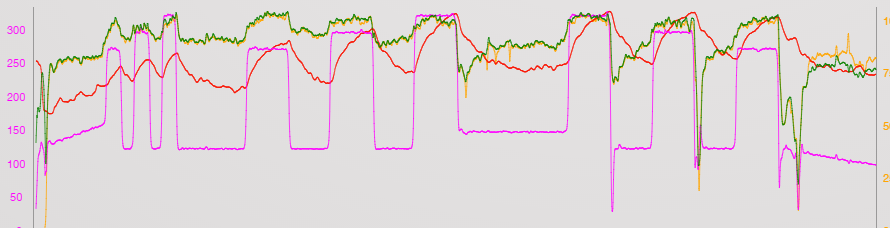

# VirtualSpeed
Compute virtual speed of indoor trainers workouts from [TrainerRoad][b4825a53]

## Problem

When training indoors, especially on [TrainerRoad][b4825a53], speed is never calculated correctly. I agree that speed is not an useful metrics when training indoors with power, but it's useful to know how much you could go outdoors for the same power output, and more importantly, to know how far you rode, in order to keep tracks of KM/year or KM/month, and know when it's time to change chain or sprockets on your trainer.

The standard calculation done by [TrainerRoad][b4825a53] is to multiply the wheel's revolutions (as measured by a speed sensor or as revolution of the flywheel for "wheel-off" trainers) per wheel circumference. This gives, when using the trainer in ERG mode,  the same speed for a given cadence, no matter the power output (100RPM is always 32.5km/h, whether you are spinning 100rpm at 100W or 330W). Obviously this is wrong.

The following image shows how the TCX from TrainerRoad is rendered on [TrainingPeaks](http://trainingpeaks.com). Notice how speed (green) follows cadence (yellow). Also notice the last part, where the ratio between speed and cadence is different: this is because I shifted to lower gears, and one pedal revolution made the wheels spin slower.

## Solution

A better way of estimating speed is by using physics. Speed depends on the power applied to pedals, minus drag, rolling resistance, gravity (when climbing uphill) and power loss in the drive-train. I reused the formuala I found on the website [The computational cyclist][ba6fa317], by Steve Gribble.

It's still an estimation as we'll never know for sure the coefficient of drag of our bike and body position, nor we'll know the rolling resistance of a certain stretch of road, but at least the speed will be a function of Power, not of cadence (see the following picture, where speed in green follows power in purple).

## What the application does

The application does nothing more than taking the TCX you can download from TrainerRoad, and updates all speed and distance values using the new estimation. 

## Launching the application

The application takes one mandatory argument : the file to fix.

Another optional argument can be used : an xml file containing the physics model parameters. If the file is not specified then the default parameters are used.
An example file is given to show the syntax.
Not all parameters need to be set : if one is missing then the default value is used.

  [b4825a53]: http://www.trainerroad.com "TrainerRoad"
  [ba6fa317]: http://www.gribble.org/cycling/power_v_speed.html "The computational cyclist"
